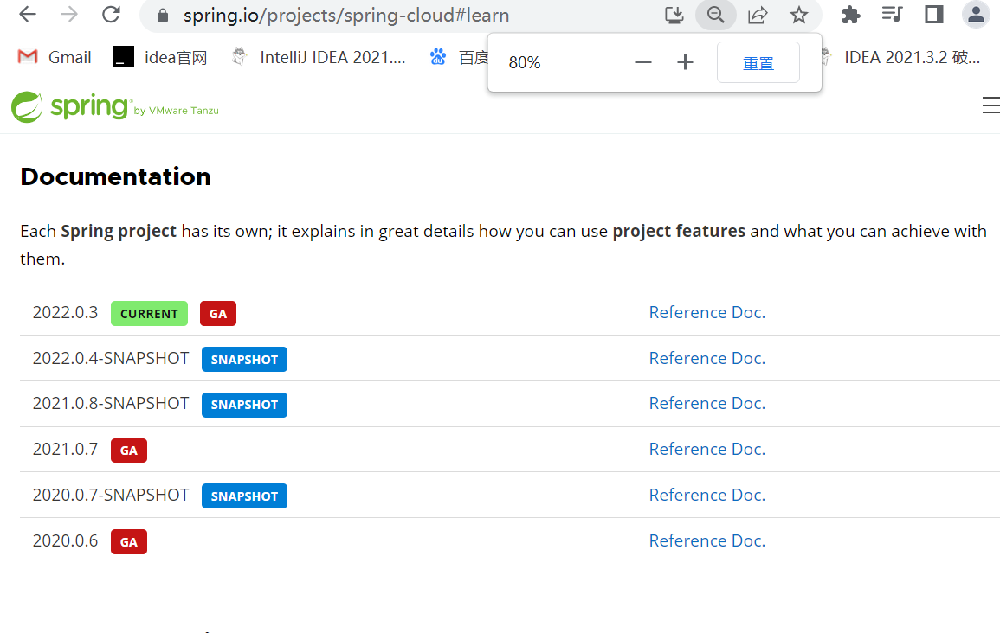

一站式微服务解决方案 Spring Cloud Netflix
一站式微服务解决方案 Spring Cloud Alibaba

Spring Cloud Netflix(开源组件)
 * Eureka
 * Hystrix
 * Hystrix Dashboard
 * Hystrix Turbine
 * Ribbon
 * Feign
 * Zuul

Spring Cloud Alibaba
* 开源组件
  * Nacos Discovery
  * Nacos Config
  * Sentinel
  * RocketMQ
  * Seata
  * Dubbob Spring Cloud
* 商业化组件
  * ANS
  * ACM
  * OSS
  * SMS
  * SchedulerX

大纲
一站式微服务解决方案Spring Cloud Netflix
1. 分布式与为服务架构的理论梳理；
2. 什么是Spring Cloud?
3. Spring Cloud的整体架构（与Dubbo比较）
4. 服务消费者Controller直接调用服务提供者Controller（http协议的restful）
5. Spring Cloud 的注册中心 Eureka
6. Spring Cloud Eureka 与 Zookeeper 比较
7. Spring Cloud Eureka 高可用集群
8. Spring Cloud Eureka 自我保护机制
9. Spring Cloud Ribbon 负载均衡
10. Spring Cloud Feign 声明式服务调用（与Dubbo接口层比较）
11. Spring Cloud Hystrix 服务熔断降级、服务限流
12. Spring Cloud Hystrix Dashboard 仪表盘监控
13. Spring Cloud Hystrix Turbine 聚合监控
14. Spring Cloud Zuul 网关（路由、过滤、异常、降级）
15. Spring Cloud Config 配置中心（用途、使用、加解密）
16. Spring Cloud Config 配置中心（自动刷新、高可用、安全认证）
17. Spring Cloud Sleuth 分布式链路跟踪
18. Spring Cloud Sleuth 整合Zipkin分布式链路跟踪
19. Spring Cloud Stream 消息驱动框架
20. Spring Cloud 微服务安全机制
21. Spring Cloud 集成携程Apollo分布式配置中心

一站式微服务解决方案 Spring Cloud Alibaba
1. Spring 家族开源项目梳理
2. Spring Cloud 下的开源项目梳理
3. Spring Cloud Alibaba 下的开源及商业项目梳理
4. 微服务的基础模型：服务消费者-注册中心-服务提供者
5. What is Nacos?
6. Nacos的运行环境部署（Java写的，Springboot项目）
7. Nacos的后台web管控台
8. Nacos作为注册中心注册服务
9. Nacos作为注册中心发现/订阅服务
10. 服务消费者负载均衡调用服务提供者（ribbon）restTemple、feign（openfeign）
11. Nacos宕机时服务消费者缓存注册中心信息
12. Nacos作为配置中心存储项目各种配置
13. Nacos作为配置中心支持自动配置刷新（不需要重启应用）
14. Nacos配置中心DataId+Group+Properties/yaml+配置内容（比较灵活）
15. Nacos配置中心多环境配置（profile）即${spring.application.name}-${profile}.${file-extension:properties}
16. Nacos服务配置数据模型（命名空间、Group、Data Id）
17. Nacos数据持久化（mysql）
18. Nacos集群部署（nginx）
19. 主要调用方式：restTemplate、feign、ribbon（spring cloud）
20. 流量控制Sentinel（流控、降级、热点、系统、授权、规则）
21. Sentinel Darshboard通信原理（与微服务通信）
22. Sentinel对应用保护的三种方式
23. Sentinel整合RestTemplate流控熔断
24. Sentinel整合Feign流控熔断
25. Sentinel规则持久化（默认、0pull模式、push模式）
26. Spring Cloud Gateway网关（核心概念、如何工作、路由、谓词11个、过滤器31个）
27. Spring Cloud Gateway自定义谓词
28. Spring Cloud Gateway谓词不匹配404处理
29. Spring Cloud Gateway自定义路由过滤器
30. Spring Cloud Gateway全局过滤器（默认自动配置，无需单独配置）
31. Spring Cloud Gateway集成ribbon负载均衡
32. Spring Cloud Gateway集成Sentinel
33. Spring Cloud Gateway集成Sentinel规则持久化（文件、nacos）
34. Spring Cloud Gateway内部流程源码分析
35. Spring Cloud gateway跨域CORS
36. SkyWalking分布式链路跟踪
37. SkyWalking主要功能特性和整体架构
38. SkyWalking环境搭建部署
39. SkyWalking Agent跟踪微服务
40. IDEA中使用SkyWalking Agent跟踪运行的程序
41. SkyWalking告警和回调通知
42. SkyWalking持久化到Elasticsearch
43. SkyWalking跨多个微服务跟踪
44. 自定义SkyWalking链路跟踪
45. SkyWalking集成日志框架logback
46. SkyWalking ui 页面功能
47. SkyWalking 集群
48. 什么事分布式事务
49. What is Seata?
50. Seata TC Server 运行环境部署
51. AT事务模式-单体应用多数据源应用
52. AT事务模式-微服务应用
53. AT事务模式工作机制
54. Seata TC Server集群部署
55. TCC事务模式执行机制
56. 基于SpringBoot单体应用的TCC事务
57. 基于Spring Cloud Alibaba的TCC分布式事务
58. Spring Cloud Stream

-----------------------------------------------

-----------------------------------------------

一点理论概念的梳理（也很重要）

在系统架构与设计的实践中，从宏观上可以总结为三个阶段；

集中式架构：
  就是把所有的功能、模块都集中到一个项目中，部署在一台服务器上，从而对外提供服务（单体架构、 单体服务、单体应用）。
  直白一点：就是只有一个项目，只有一个war。

分布式架构：
  就是把所有的功能、模块拆分成不同的子项目，部署在多台不同的服务器上，这些子项目相互协作共同对外提供服务。
  直白一点：就是有很多项目，有很多war包，这些项目相互协作完成需要的功能，不是一个war能完成的，一个war包完成不了；
  比如：
  Shop项目：单体应用
  Shop项目：拆分-->(user-center，order-center，trade-center)分布式应用

微服务架构：
  分布式强调系统的拆分，微服务也是强调系统的拆分，微服务架构属于分布式架构的范畴；
  并且到目前为止，微服务并没有一个统一的标准的定义，那么微服务究竟是什么？

  微服务一词源于Martin Fowler(马丁·福勒)的名为 Microservices 的博文，
  可以在他的官方博客上找到这批文章：
  http://martinfowler.com/articles/microservices.html
  中文翻译版本：
  https://www.martinfowler.cn/microservices/

简单地说，微服务是系统架构上的一种设计风格，它的主旨是将一个原本独立的系统拆分成多个小型服务，
这些小型服务都在各自独立的进程中运行，
服务之间通过基于HTTP的Restful API进行通信协作；
（dubbo-->dubbo协议）
Restful API(controller-->调用controller)
被拆分后的每一个小型服务都专注于完成系统中的某一项业务功能，职责单一，并且每个服务都是一个独立的项目，可以进行独立的测试、开发和部署等。
由于各个独立的服务之间使用的是基于 HTTP的JSON作为数据通信协作的基础，
所以这些微服务也可以使用不同的语言来开发；


比如：项目里面有User模块和Order模块，但是User模块和Order模块并没有直接关系，
仅仅只是一些数据需要交互，那么就可以把这两个模块单独分开来，
当User需要调用Order的时候，Order是一个服务方，但是Order需要调用User的时候，User又是服务方了，
所以，他们并不在乎谁是服务方谁是调用方，他们都是两个独立的服务，这就是微服务的概念；

经典面试：分布式与微服务有什么区别？

分布式，就是将巨大的一个系统划分为多个模块，这一点和微服务是一样的，
都是要把系统进行拆分，部署到不同的机器上，
因为一台机器可能承受不了这么大的访问压力了，
或者说要支撑这么大的访问压力需要采购一台性能超级好的服务器，
其财务成本非常高，有这都些预算完全可以采购很多台普通的服务器了，
分布式系统各个模块通过接口进行数据交互，其实分布式也是一种微服务，
因为都是把模块拆分变为独立的单元，提供接口来调用，那么它们本质的区别是什么？

它们的本质的区别体现在“目标”上，何为目标，
就是你采用分布式架构或者采用微服务架构，你最终是为了什么，要达到什么目的？

分布式架构的目标是什么？
就是访问量很大，一台机器承受不了，或者是成本问题，不得不使用多台机器来完成服务的部署。

而微服务的目标是什么？
只是让各个模块拆分开来，不会被互相影响，比如模块的升级或者出现BUG或者是重构等等都不要影响到其他模块，
微服务它是可以在一台机器上部署的。  

但是：分布式也是微服务的一种，微服务也属于分布式；

面试：微服务与Spring Cloud 的关系或者区别？
微服务只是一种项目的架构方式、架构理念，或者说是一种概念，
就如同我们的MVC架构一样，那么Spring Cloud便是对这种架构方式的技术落地实现；

微服务一定要使用Spring Cloud 吗？
微服务只是一种项目的架构方式、架构理念，
所以任何技术都可以实现这种架构理念，只是微服务架构里面有很多问题需要我们去解决，
比如：负载均衡，服务的注册与发现，服务调用，服务路由，服务熔断等等一系列问题，
如果你自己从0开始实现微服务的架构理念，那头发都掉光了，
所以Spring Cloud帮我们做了这些事情，
Spring Cloud将处理这些问题的技术全部打包好了，我们只需要开箱即用；

--------------------------------------------

--------------------------------------------

What is Spring Cloud?

官网：https://spring.io/projects/spring-cloud
版本：Greenwich SR3



出自官方：
```text
Spring Cloud provides tools for developers to quickly build some of the common patterns in distributed systems (e.g. configuration management, service discovery, circuit breakers, intelligent routing, micro-proxy, control bus, one-time tokens, global locks, leadership election, distributed sessions, cluster state). Coordination of distributed systems leads to boiler plate patterns, and using Spring Cloud developers can quickly stand up services and applications that implement those patterns. They will work well in any distributed environment, including the developer’s own laptop, bare metal data centres, and managed platforms such as Cloud Foundry.
```

Spring Cloud为开发人员提供了一些工具用来快速构建分布式系统中的一些常见模式和解决一些常见问题
（例如配置管理、服务发现、断路器、智能路由、微代理、控制总线、一次性令牌、全局锁、领导选举、分布式会话、群集状态）。
分布式系统的协调导致了很多样板式的代码（很多固定套路的代码），
使用Spring Cloud开发人员可是快速寄哪里实现这些模式的服务和应用程序。  
他们在任何分布式环境中都能很好的运行，包括开发人员自己的笔记本电脑、裸机数据中心和云计算等托管平台；

Spring Cloud特性

Spring Cloud为分布式系统开发的典型应用场景提供良好的开箱即用的功能。
比如：
分布式/版本化配置
服务注册和发现
路由
服务与服务间的调用
负载均衡
断路器
全局锁
领导选举与集群状态
分布式消息传递

Spring Cloud下的主要项目

Spring Cloud Config 
Spring Cloud Netflix
Spring Cloud Bus
Spring Cloud Cloudfoundry
Spring Cloud Open Service Broker
Spring Cloud Cluster
Spring Cloud Consul
Spring Cloud Security
Spring Cloud Sleuth
Spring Cloud Data Flow
Spring Cloud Stream
Spring Cloud Stream App Starters
Spring Cloud Task
Spring Cloud Task App Starters
Spring Cloud Zookeeper
Spring Cloud AWS
Spring Cloud Connectors
Spring Cloud Starters
Spring Cloud CLI
Spring Cloud Contract
Spring Cloud Gateway
Spring Cloud OpenFeign
Spring Cloud Pipelines
Spring Cloud Function

Spring Cloud 的版本
Spring Cloud是由一系列独立项目组成的，
每个独立的项目具有不同的发布节奏，
每次Spring Cloud发布版本时，就会组合这一系列的子项目，
Spring Cloud为了避免大家对版本号的误解，
避免与子项目版本号混淆，所以Spring Cloud发布的版本是一个按照字母顺序的伦敦地铁站的名字
（“天使” 是第一个版本，“布里克斯顿”是第二个），
字母顺序是从A-Z，目前最新稳定版本Greenwich SR3，
当Spring Cloud里面的某些子项目出现关键性bug或者重大更新，
则发布序列将推出名称以".SRX"结尾的版本，
其中"X"是一个数字，比如：Greenwich SR1、Greenwich SR2、Greenwich SR3；
Spring Cloud是微服务开发的一整套解决方案，采用Spring Cloud开发，
每个项目依然是使用Spring Boot；

Spring Cloud与Spring Boot的兼容版本表格


--------------------------------------

--------------------------------------

2. Spring Cloud的整体架构

Service Provider: 暴露服务的服务提供方。
Service Consumer: 调用远程服务的服务消费方。
Eureka Server: 服务注册中心和服务发现中心。

3. 服务消费方直接调用服务提供方
我们知道，SpringCloud构建微服务是基于SpringBoot开发的。


